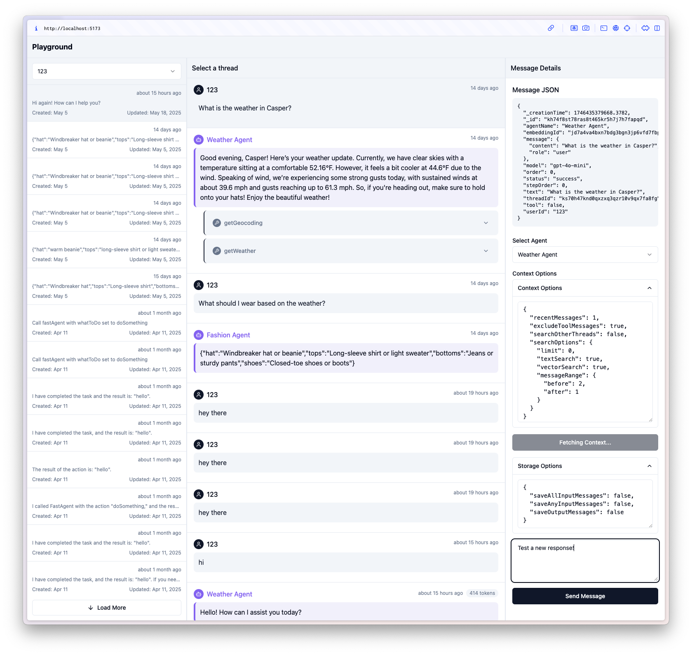

# Agent Playground

This is a playground for @convex-dev/agent.



- Pick a user to list their threads.
- Browse the user's threads.
- List the selected thread's messages, along with tool call details.
- Show message metadata details.
- Experiment with contextual message lookup, adjusting context options.
- Send a message to the thread, with configurable saving options.
- It uses api keys to communicate securely with the backend.

There is also a [hosted version here](https://get-convex.github.io/agent/).

# Setup

```sh
npm i @convex-dev/agent-playground
```

In your agent Convex project, make a file `convex/playground.ts` with:

```ts
import { definePlaygroundAPI } from "@convex-dev/agent-playground";
import { components } from "./_generated/api";
import { weatherAgent, fashionAgent } from "./example";

/**
 * Here we expose the API so the frontend can access it.
 * Authorization is handled by passing up an apiKey that can be generated
 * on the dashboard or via CLI via:
 * ```
 * npx convex run --component agent apiKeys:issue
 * ```
 */
export const {
  isApiKeyValid,
  listAgents,
  listUsers,
  listThreads,
  listMessages,
  createThread,
  generateText,
  fetchPromptContext,
} = definePlaygroundAPI(components.agent, {
  agents: [weatherAgent, fashionAgent],
});
```

From in your project's repo, issue yourself an API key:

```sh
npx convex run --component agent apiKeys:issue '{name: "my key"}'
```

Then run the playground:

```sh
npx @convex-dev/agent-playground
```

It uses the `VITE_CONVEX_URL` env variable, usually pulling it from .env.local.

- Enter the API key in the box.
- If you used a different path for `convex/playground.ts` you can enter it.
  E.g. if you had `convex/foo/bar.ts` where you exported the playground API,
  you'd put in `foo/bar`.

## Feature wishlist (contributions welcome!)

- Show threads that aren't associated with a user as "no user" in the dropdown.
- Constrict the message sending to be using the context of the selected message.
  It currently sends as if it were at the end of the thread.
- Show the contextual messages with their rank in vector & text search, to get
  a sense of what is being found via text vs. vector vs. recency search.
- Send down the agent's default context & storage options to use as the default.
